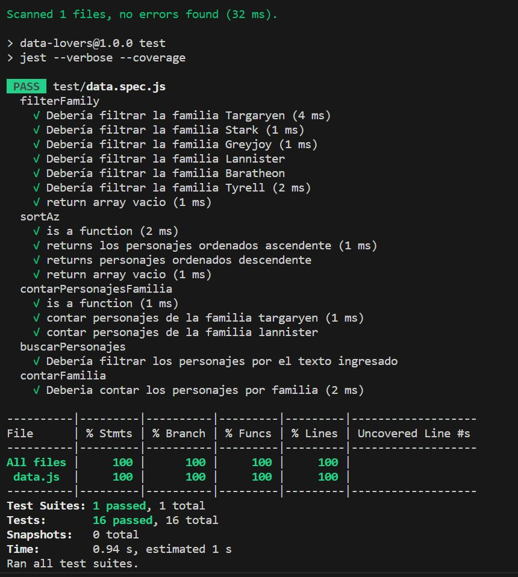
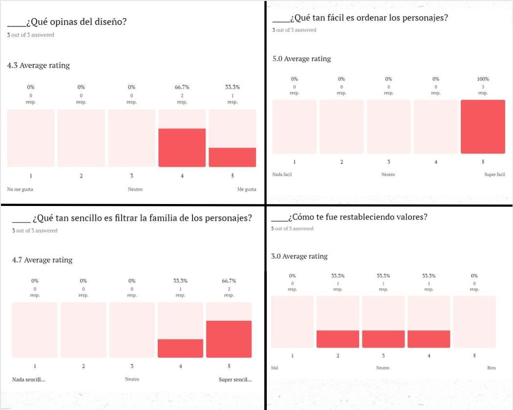

# Game Of Thrones Lovers

## Índice

* [1. Definición del producto.](#1-definicion-del-producto)
* [2. Herramientas utilizadas.](#2-herramientas-utilizadas)
* [3. Historias de usuario.](#3-historias-de-usuario)
* [4. Prototipos.](#4-prototipos)
* [5. Interfaz.](#5-interfaz)

## 1. Definición del producto.

El proyecto está basado en la data de Game of Thrones.

"Game of Thrones" es una serie de televisión de drama y
fantasía épica creada por David Benioff y D.B. Weiss,
basada en la serie de novelas "Canción de Hielo y Fuego"
del autor George R.R. Martin. La serie sigue las luchas y
conflictos entre varias casas nobles en el ficticio 
continente de Westeros, mientras compiten por el Trono de 
Hierro y el control de los Siete Reinos.

- **¿Quiénes son los principales usuarios de producto?** 
                        
  Fanáticos de Game Of Thrones
- **¿Cuáles son los objetivos de estos usuarios en relación 
con el producto?**

  Objetivo es conocer la información más relevante de cada 
  personaje
 

- **¿Cuáles son los datos más relevantes que quieren ver en 
la interfaz y por qué?**
  
  Apellidos o casas: para saber a qué familia pertenece el 
  personaje, nacimiento y muerte como datos curiosos, y 
  título o sobre nombre.
- **¿Cuándo utilizan o utilizarían el producto?**
  
  Cuando quieran más información de los 
  personajes.

## 2. Herramientas utilizadas.
  - **Trello**: Organización de equipo. 
  - **Figma**: Crear prototipos.
  - **Typeform**: Formulario con preguntas para el test de 
  usabilidad.
  - **HTML**: Dar estructura a la interfaz.
  - **CSS**: Para dar estilo a la interfaz.
  - **Javascript**: Para dar funcionalidad a la aplicación.
  - **Jest**: Pruebas unitarias de las funciones implementadas 
  en javascript.
  
 
 ## 3. Historias de usuario.
  Según la necesidad de los usuarios y entendiendo lo que 
  querían evidenciar en el sitio, realizamos 5 historias:
  ### 3.1 Primera historia de usuario 
    
  - **Yo como**: Usuario de la página
  - **Quiero**: Ver las imágenes y nombre de los personajes
  - **Para**: identificar los nombres de los personajes que 
  aún no me sé.

  **Criterios de aceptación**: 
  - Imágenes visibles en la misma página según criterios del 
  flexbox.
  - Imagen interactiva al pasar el cursor se muestre el 
  reverso de la imagen con la información de cada personaje.

  **Definición de terminado**:
  - Que el diseño sea igual al prototipo de alta fidelidad.
  - Feedback de dos usuarios de la página y del test de 
  usabilidad desde los prototipos.

  ### 3.2 Segunda historia de usuario
    
  - **Yo como**: Usuario de la página y fan de GOT.
  - **Quiero**: filtrar las familias de los personajes 
  (casas).
  - **Para**: encontrar los personajes que pertenecen a la 
  misma familia.

  **Criterios de aceptación**: 
  - Botón “Filtrar por familia”.
  - Que al darle clic al botón “Filtrar por familia” se 
  muestre el menú desplegable con las opciones.
  - Que al darle clic en cada opción se organicen los 
  personajes por la familia seleccionada.

  **Definición de terminado**:
  - Que el botón funcione de manera correcta.
  - Que al hacer clic en las opciones me filtre la 
  información.
  - Correr la primera prueba unitaria.
  ### 3.3 Tercera historia de usuario
    
  - **Yo como**: Usuario de la página y fan de GOT.
  - **Quiero**: ordenar los personajes de A-Z y Z-A.
  - **Para**: ver los personajes en orden alfabético.

  **Criterios de aceptación**: 
  - Prototipo de alta y baja fidelidad.
  - Test de usabilidad a los prototipos de alta fidelidad.
  - Botón “Ordenar”.
  - Que al darle clic al botón “Ordenar” se muestre el menú 
  desplegable con las opciones.
  - Que al darle clic se organicen los personajes por el 
  orden seleccionado.

  **Definición de terminado**:
  - Que el botón funcione de manera correcta.
  - Que al hacer clic en las opciones me organice la 
  información.
  - Correr la prueba unitaria para esta función.

  ### 3.4 Cuarta historia de usuario
    
  - **Yo como**: Usuario de la página y fan de GOT.
  - **Quiero**: Que al usar el filtro me aparezca la suma de los 
  personajes.
  - **Para**: saber la cantidad de personajes por familia.

  **Criterios de aceptación**: 
  - Mensaje que al filtrar las familias nos aparezca cuantos 
  personajes hay en total
  - El mensaje se entienda y tenga estilo
  - Me cuenten los personajes al restablecer el filtro.
  
  **Definición de terminado**:
  - Mensaje funcione de manera correcta.
  - Correr la prueba unitaria para esta funcion.

### 3.5 Quinta historia de usuario
    
  - **Yo como**: Usuario de la página y fan de GOT.
  - **Quiero**: tener un buscador en tiempo real y un botón 
  que me reinicie los filtros.
  - **Para**: encontrar los personajes al ingresar su nombre 
  en el buscador y limpiar los resultados.

  **Criterios de aceptación**: 
  - Input “Buscar por nombre”.
  - Que al ingresar texto me busque el nombre del personaje 
  por la letra inicial.
  - Que me cuente cuantos personajes inician de manera 
  similar.
  - Botón "Home"
  - Restablecer la página.
  
  **Definición de terminado**:
  - Que el input funcione de manera correcta.
  - Correr la prueba unitaria para esta función.
  - Mensaje de la cantidad de personajes que coincidan en la 
  búsqueda.
  - Que el botón  "home" reinicie la página.
  - Readme finalizado.
  - Deploy en GitHub pages.
  - Test de usabilidad a la página desplegada.

## 4. Prototipos.

- **Prototipo de baja fidelidad**
Realizamos prototipo de baja fidelidad en [Figma](https://www.figma.com/file/ORBg4sqpJGma5nz1g8rByV/Baja-Fidelidad?type=design&node-id=0-1&mode=design&t=ql3BblygxMm7PGqw-0) 
para diferentes dispositivos. 
 
- **Prototipo de alta fidelidad**
Realizamos prototipo de alta fidelidad en [Figma](https://www.figma.com/file/sJ1DGDqS5wBH9yooxShePZ/Prototipo-alta-fidelidad?type=design&node-id=0-1&mode=design&t=2jvXFrKOsDLtDPpd-0) para difetentes dispositivos

### 4.1 . Test de usabilidad de prototipos.
Realizamos el test de usabilidad desde los prototipos para las 
tres primeras historias de usuario y estos fueron los 
resultados:

Teniendo en cuenta los resultados del test de usabilidad, se 
llegó a la conclusión de que era necesario un botón que 
reestableciera valores en la página. 

## 5. Interfaz.
En la interfaz, el usuario puede interactuar con los 
diferentes botones donde restablece valores, busca los 
personajes por nombre, filtra por familia y ordena 
alfabéticamente, la información adicional
de cada personaje se puede visualizar al pasar el cursor por la imagen de cada 
uno. 
[Aquí](https://manuela-hernandez.github.io/DEV009-data-lovers/src/) puedes acceder a la interfaz.

- ### Version movil

https://github.com/LauraJoya19/DEV009-data-lovers/assets/133243351/88233cc5-904b-4508-903c-a02b30c7fe09

- ### Version Desktop

https://github.com/LauraJoya19/DEV009-data-lovers/assets/133243351/b2dbd032-977b-41a7-9ab8-dde50ea86b4c

### 5.2 Test de usabilidad de la interfaz
Una vez nuestros usuarios interactuaron en la interfaz, 
hicieron el test el cual dio como resultado que la interfaz 
es útil y satisfactoria.

## Desarrolladoras

- [@LauraJoya19](https://github.com/LauraJoya19) 
- [@Manuela-Hernandez](https://github.com/Manuela-Hernandez)
